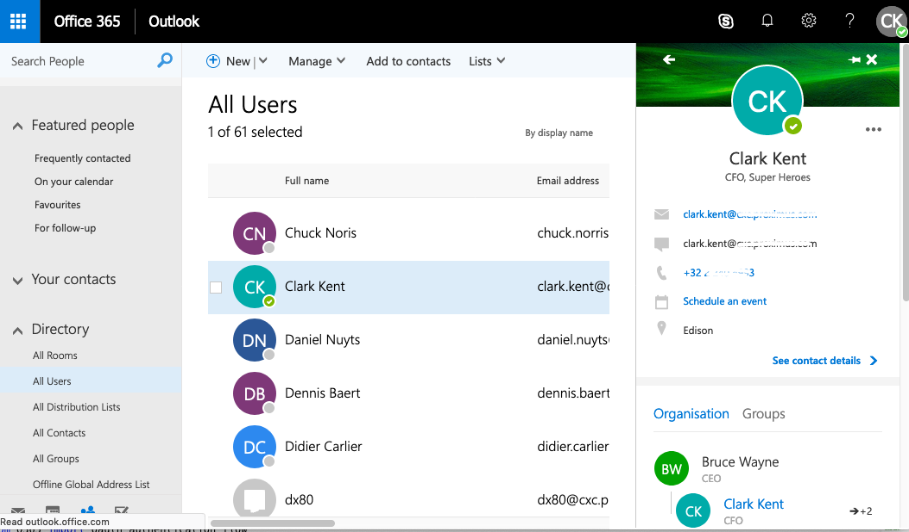
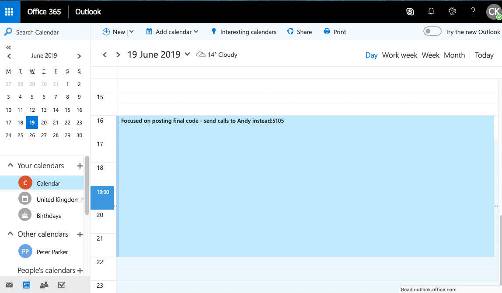
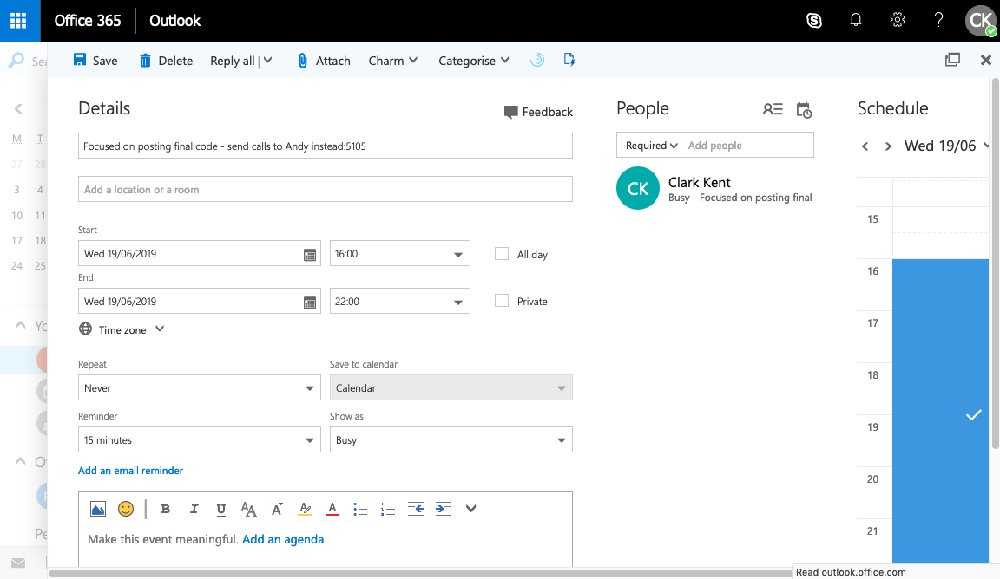

# Route CUCM calls by O365 calendar with CURRI

This is a simple Python script that implements an adjunct route server to make call-routing decisions for Cisco Unified Communications Manager by using Cisco Unified Routing Rules Interface (CURRI)

This script uses an Office 365 account to make routing decisions based on the calendar availability of the users. 

As CUCM receives a call destined for a user, the Office 365 directory is queried to match the caller ID with a particular user and then check the calendar for that user to see if they are in a meeting or otherwise not available. 

Depending on the availability status, the call is rejected with an announcement, sent to voicemail or it proceeds with a "warning" announcement that the recipient might not pickup because they are away momentarily. 

If the subject of the meeting has a phone number after a ':' character, it will extract that number and use it to redirect the call if the meeting indicates the user is in a "Busy" state.

For example:

If a call comes in for Clark Kent's number as shown in the directory:


Then the Office 365 calendar entry for that users is checked for any current meetings:


Depending on the status of the calendar entry such as "Busy", instructions are sent to CUCM on how to route the call and which annoucement, if any, to play. In this example, since the meeting shows busy and the subject line contains a number after the ':' , the adjunct route server will return instructions to CUCM to reroute the call to extension 5105:  



## Dependencies and initial setup:

Python 3.6 with the following modules installed: 

1. O365  

There are full instructions on how to install the O365 library and how to authenticate and generate the necessary O365 tokens you need to provide in the config.sys file at https://pypi.org/project/O365/
The O365 library usese the Microsoft Graph API. 

The CURRI route server code from this repository is derived from the official Cisco CURRI developer's guide sample code at:
https://developer.cisco.com/site/curri/discover/getting-started/
It has been updated to run in Python 3.6 which is a requirements for the O365 library.

The code also assumes there are 2 announcements in the CUCM server that is seding route requests so that they can be played back to callers under certain conditions with the following announcement identifiers:

**user_unavailable**  
This should say something like: "I'm in a meeting. Please try again later"

**in_meeting**
This should say something like: "I'm just in a meeting. Stay on the line. My colleagues will help you in a moment"

It is assumed that the users of this sample code are familiar with Cisco Unified Communications Manager dial plans and call routing concepts and have a properly configured setup to do testing. 
 

## Running the code:

In a terminal window change directory to the location of the source code from this repository, then run the script as in this example: 

```python3 curri-o365.py <hostname> 8080 http```

When you first run the code or if the tokens have expired, the script will output a URL to be used for authentication and token generation. 

```Visit the following url to give consent: https://login.microsoftonline.com/common/oauth2/v2.0/authorize?response_type=code&client_id=..... ```

Copy that URL into a browser and authenticate with the O365 account being used. After authenticating, the browser will show a blank screen but 
will have a different URL in the address bar. Copy that URL and provide it as input to the prompt you will be shown (see below) and press enter:

```Paste the authenticated url here:```

That will generate a new token text file in the same directory as where the code is being run from and will not prompt again when you 
launch the script while the tokens are valid.

You then need to configure a URL to that server in the External Call Control Profile on the Cisco Unified Communications Manager server you intend to use. The URL needs to have a path even if you are just running it from the command line as shown above and the server code does not handle any paths, so for that example the line to configure in the ECCP in CUCM would be:

```http://<hostname>:8080/CURRI```

More instructions on how to configure an ECCP and how to associated it to the various routing mechanisms in CUCM can be found here: 
https://d1nmyq4gcgsfi5.cloudfront.net/site/curri/learn/how-to/configure-external-call-control-profile/
Also here:
https://www.cisco.com/c/en/us/td/docs/voice_ip_comm/cucm/admin/10_0_1/ccmfeat/CUCM_BK_F3AC1C0F_00_cucm-features-services-guide-100/CUCM_BK_F3AC1C0F_00_cucm-features-services-guide-100_chapter_011010.html
Or in the equivalent for the version of CUCM you are using.

## Notes and areas for improvement 
- The code could be modified to use APScheduler (Advanced Python Scheduler) to run a background scheduler before the 90 days of token expiration time in order to refresh the token via Connection.refresh_token
- The use of get_all_contacts_dict(account) means we need to schedule a daily sync so that changes in Azure AD are synced with our contacts variable.
- This code could be incorporated into a flask based application so that it can be deployed on any web server with WSGI capabilities.


